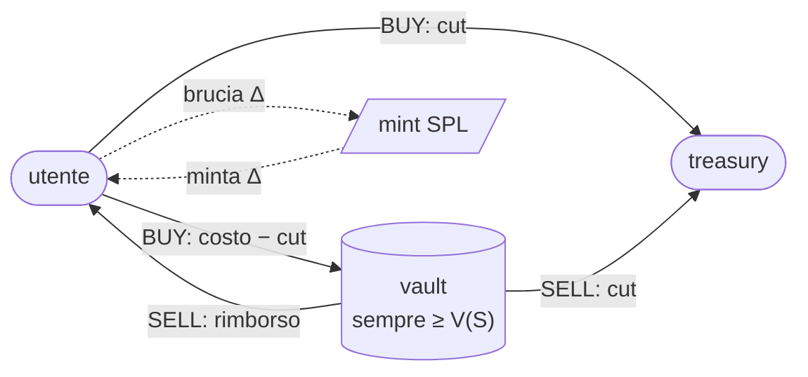

<div align="center">

# Token sperimentale

**Market maker autonomo su Solana**

Il prezzo dipende solo dalla supply.
Nessun oracolo, nessun owner, nessuna istruzione di prelievo.

[](#verifica)
[](https://www.anchor-lang.com/)
[](https://github.com/anza-xyz/agave)
[](#build)
[](#prima-del-deploy)

</div>

---

> [!IMPORTANT]
> **Due vincoli non negoziabili.**
> 1. La build va fatta con **`--arch v3`** — SIMD-0500 vieta il deploy di SBPF v0/v1/v2, quindi l'artefatto di default viene rifiutato dal loader.
> 2. I test devono girare sullo **stesso `.so` che si deploya**. È il corollario del punto 1, e conta di più: una suite che verifica un bytecode diverso da quello spedito non produce mai un test rosso.
>
> Il perché, e come verificarlo, sono in cima a **[`SECURITY.md`](SECURITY.md)**.

---

## Come funziona

Il vault contiene sempre almeno `V(S)`, l'area sotto la curva fino alla supply corrente. È la garanzia di liquidità per ogni venditore, e non dipende da alcun buffer: lo spread va alla treasury **solo** per la parte che eccede quel valore.



<table>
<tr>
<td valign="top"><b>Curva</b><pre>
P(s) = P0 · (1 + s/S0)²

V(s) = P0 · N(s) / (3·S0²)
N(s) = 3·S0²·s + 3·S0·s² + s³
</pre></td>
<td valign="top"><b>Regolamento</b><pre>
BUY   paga    ceil(ΔV · (1 + φ/2))  e minta
SELL  riceve  floor(ΔV · (1 − φ/2)) e brucia
</pre>
L'arrotondamento è sempre a favore del vault.</td>
</tr>
</table>

| Parametro | Valore |
| :--- | ---: |
| Prezzo a supply 0 | **0,1 SOL** / token |
| Prezzo a supply massima | **1,0 SOL** / token |
| Moltiplicatore `M` | **10×** |
| Supply massima | 10⁶ token · 6 decimali |
| Spread `φ` | 1,00% — 0,5% per lato |
| Raccolta a supply piena | ≈ 472 076 SOL |

Gli invarianti `I1`–`I14` e i lemmi `L1`–`L3` sono in testa a [`programs/autonomous-mm/src/lib.rs`](programs/autonomous-mm/src/lib.rs).

## Interfaccia

| Istruzione | Firme | Note |
| :--- | :--- | :--- |
| `initialize` | deployer + **treasury** | la treasury firma per provare di stare sulla curva ed25519 |
| `buy(amount, max_cost)` | utente | minta, con guardia di slippage |
| `sell(amount, min_refund)` | utente | brucia, con guardia di slippage |
| `quote(amount)` | — | sola lettura; rispetta gli stessi limiti del settlement (`I14`) |

## Build

```bash
cargo test -p autonomous-mm --lib     # 33 test matematici (17 property-based)
cargo-build-sbf --arch v3             # artefatto deployabile → target/deploy/
cd integration && cargo test          # 43 test on-chain su litesvm
```

<details>
<summary><b>Perché <code>integration/</code> è un workspace separato</b></summary>

<br>

Unificare le sue dipendenze con quelle di Anchor rompe la build SBF attraverso `getrandom`. Due vincoli sono deliberati:

- **`solana-sdk` pinnato a `=4.0.1`** — la 4.1 richiede `solana-short-vec ^3.3`, litesvm 0.16 richiede `~3.2.2`: incompatibili.
- **`five8_core` con feature `std`** — senza, `solana-keypair 3.1.2` non compila, con un errore che non nomina mai `five8_core`.

</details>

<details>
<summary><b>Prova su validator reale</b></summary>

<br>

```bash
solana-test-validator --reset &

solana program deploy target/deploy/autonomous_mm.so \
  --program-id target/deploy/autonomous_mm-keypair.json -k <deployer>

cargo run --bin ceremony -- <deployer>          # initialize, buy, sell, CU, eventi
solana program set-upgrade-authority <id> --final -k <deployer>
cargo run --bin ceremony -- <deployer> post     # il mercato regge da immutabile
```

</details>

La toolchain si installa da sola tramite il SessionStart hook in [`.claude/hooks/session-start.sh`](.claude/hooks/session-start.sh).

## Verifica

<table>
<tr>
<td align="center"><b>33</b><br>test matematici<br><sub>17 property-based</sub></td>
<td align="center"><b>43</b><br>test on-chain<br><sub>sull'artefatto reale</sub></td>
<td align="center"><b>19/19</b><br>mutazioni<br><sub>tutte catturate</sub></td>
<td align="center"><b>18 694</b><br>CU nel caso peggiore<br><sub>9% del budget</sub></td>
</tr>
</table>

La suite è validata per **mutation testing**: diciannove difetti iniettati deliberatamente nel programma devono far fallire i test. Due sono sopravvissute al primo giro e la suite è stata rafforzata finché non le ha catturate. Tre convinzioni di chi ha scritto i test sono state smentite dall'esecuzione — sono elencate in `SECURITY.md`, perché dicono quanto vale il resto.

Il consumo peggiore misurato è **18 694 CU**, il 9% del budget di default, con la curva percorsa **a scala piena** — dove l'aritmetica tocca l'88% di `u128::MAX`. Sul validator reale gli eventi arrivano via RPC con tutti i campi corretti, quattro acquisti concorrenti pagano in totale esattamente la somma dei prezzi sequenziali, e il mercato continua a funzionare dopo che l'upgrade authority è stata bruciata.

> [!NOTE]
> **I lamports versati al vault sono irrecuperabili.** Il cut è cappato dallo spread del singolo trade, quindi la treasury incassa il flusso e mai lo stock: chi invia fondi al vault li perde. Il dettaglio è in [`SECURITY.md`](SECURITY.md).

Difetti trovati, metodo e — soprattutto — **cosa resta non verificato**: **[`SECURITY.md`](SECURITY.md)**.

## Prima del deploy

> [!WARNING]
> **Non è pronto per la produzione così com'è.**
> `EXPECTED_DEPLOYER` contiene una chiave di test la cui privata è derivabile dal seed `[7u8; 32]` scritto in `integration/src/lib.rs`: **chiunque legga questo repo può inizializzare il mercato al posto vostro**. Va sostituita prima di qualsiasi cluster condiviso, devnet inclusa. Anche il program id appartiene a una keypair generata in sviluppo.

Le due identità stanno in un unico blocco in testa a `src/lib.rs`, sdoppiate per configurazione. Compilando per la produzione un `const assert` **rifiuta la build** finché sono ancora quelle di test o i segnaposto:

```bash
cargo-build-sbf --arch v3 -- --features production
```

La checklist completa è in fondo a [`SECURITY.md`](SECURITY.md).

## Struttura

```
programs/autonomous-mm/
├── src/lib.rs              programma + invarianti in testa
└── src/tests_math.rs       suite avversariale sulla matematica pura
integration/                workspace separato — test sull'artefatto SBF
├── src/lib.rs              helper + curva di riferimento indipendente
├── src/bin/ceremony.rs     prova di deploy su validator reale
├── tests/exploits.rs       exploit, stress, solvibilità
├── tests/limits.rs         scala piena, compute unit, autorità, input malformati
├── tests/edges.rs          aliasing, donazioni, evento di init
└── tests/quote.rs          coerenza preventivo ↔ settlement
SECURITY.md                 dossier per l'audit
```
